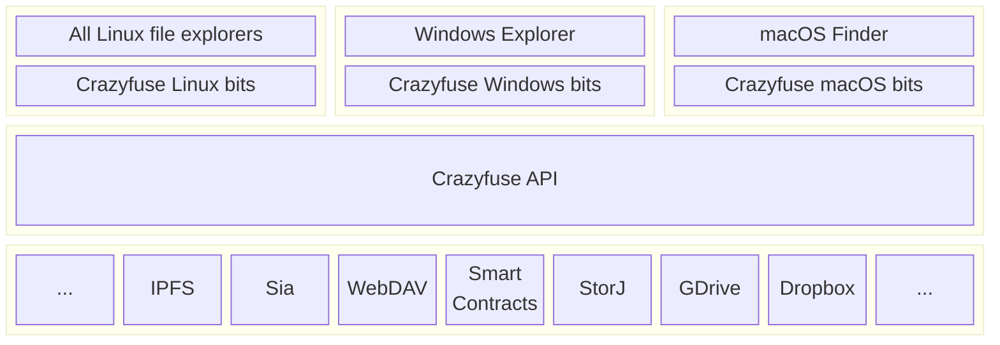

# Crazyfuse Design Document

## Introduction

:construction: Construction has started! :construction: Crazyfuse is an API designed to provide a unified API for projects to expose their data on the host operating system (Windows, macOS, Linux). This allows users to access and utilize data from various ecosystems through the familiar desktop file explorer.

## Problem Statement

Many projects, such as IPFS, Dropbox, and others, allow users to store and share data within their ecosystem. However, this data is often inaccessible outside of that specific project's environment. Currently, each platform (Windows, macOS, Linux) requires a separate implementation to make the data accessible through the host file explorer.

## High level architecture overview

This diagram aims to show how Crazyfuse is implemented. There will be 4 github repositories:
1. [Crazyfuse API](https://github.com/crazyfuse/api), this is the unified API itself. This API tries to resemble the FUSE API as closely as possible. Adding minor features to this will have an effect on the API platform specific implementations therefore features will be kept at a minimum.
2. [Crazyfuse Linux bits](https://github.com/crazyfuse/internal_api_linux), the Linux specifics to handle this Crazyfuse API.
3. [Crazyfuse macOS bits](https://github.com/crazyfuse/internal_api_macos), the macOS specifics to handle this Crazyfuse API.
4. [Crazyfuse Windows bits](https://github.com/crazyfuse/internal_api_windows), the Windows specifics to handle this Crazyfuse API.

:::info
None of these repositories currently contain code! Development of these repositories is in progress but a first push will only be done when an example implementation works without code changes (only a recompile to the target platform should be required). As of 19th november 2024, there has been quite a bit of progress but nowhere near a usable proof of concept. An initial code push (origionally planned for nov. 11th 2024) will be done when there is some usable code. This now is likely in Q1 of 2025.
:::

The last row in the diagram shows potential projects that would benefit from having a `Crazyfuse API` implementation. Initially development will focus on a `Smart Contract` and `IPFS` implementation. Smart contracts expose data that you might want to use on a system level. Once you have access to that data then any programming language or application to can access your filesystem can access smart contract data and thereby opening up many new posibilities that whithout it are hard or even impossible. IPFS already gives access to (file-like) data so it makes sense to have this be accessible natively on your host.

## Benefits

1. **Simplified Integration**: With Crazyfuse, projects only need to implement one API to expose their data on all supported platforms.
2. **Unified Access**: Users can access and utilize project-specific data through the familiar desktop file explorer, eliminating the need for multiple implementations.
3. **Increased Usability**: Data within a project's ecosystem becomes accessible outside of it through the host operating system, opening up new possibilities for programmatic and tool/application access.
4. **Reduced Maintenance Burden**: By providing a unified API, Crazyfuse reduces the maintenance burden on projects, allowing them to focus on their core functionality.

## Features

1. **API Stability**: Initially stable but not optimized for performance, with room for improvement as the project evolves.
2. **Read and Write Support**: The initial API will support read and write. However, many projects will likely only need read support so the initial focus will be on handling that efficiently. Write and optimizations thereof will follow later.
3. **Platform-Specific Features**: While not initially part of Crazyfuse, platform-specific features like visualizing pinned data can be added in future revisions.

## Target Audience

1. **Projects with Ecosystem Data**: Projects that allow users to store and share data within their ecosystem but struggle with making it accessible outside of that environment.
2. **Developers**: Developers working on projects that require access to data from various ecosystems, now benefiting from a unified API.

## Funding :money_mouth_face:

This project currently is a hobby project and self-funded. I very much welcome individuals or organizations to donate :moneybag: ! I can also be hired :moneybag::moneybag: to develop an implementation for your project.

## License

Crazyfuse will be developed under the [MIT-0](https://opensource.org/license/mit-0) license and hosted on GitHub. User contributions and feedback are encouraged and essential for the project's long-term success.

## Conclusion

Crazyfuse addresses a significant gap in the development ecosystem by providing a unified API to expose data from various projects through the host operating system. By simplifying integration, increasing usability, and reducing maintenance burdens, Crazyfuse has the potential to become an invaluable tool for developers working on projects with ecosystem data.
